# Institute Enquiry & Enrollment Analytics System

### An End-to-End Student Enquiry, Follow-up, Enrollment, Payment & Analytics Solution

A complete **Data Analytics + Application Development project** designed to manage the student journey from initial course enquiry to enrollment and payment while providing meaningful business insights through **Excel and Power BI dashboards**.

The project combines **Python, Streamlit, MySQL, Aiven Cloud, Excel, and Power BI** to demonstrate an end-to-end workflow involving data collection, database management, operational processes, analysis, and visualization.

---

## Live Application

The Streamlit application is deployed and connected to a cloud-hosted MySQL database.

### [Launch Live Application](https://institute-enquiry-enrollment-analytics-system-by-sakshi-panchal.streamlit.app/)

Explore courses, submit student enquiries, and experience the complete enquiry-to-enrollment workflow.

---

## Project Overview

Educational institutes receive enquiries from students interested in different courses. Managing these enquiries manually can make it difficult to track follow-ups, conversions, enrollments, payments, and overall business performance.

The **Institute Enquiry & Enrollment Analytics System** provides a centralized solution where:

- Students can explore available courses.
- Students can submit course enquiries.
- Enquiries are stored in a cloud MySQL database.
- Admin users can manage enquiry status and follow-ups.
- Converted enquiries can be enrolled.
- Student fee payments can be recorded and tracked.
- Excel and Power BI provide analytical insights into enquiries, conversions, enrollments, and payments.

---

##  Project Workflow

```text
Student
   ↓
Explore Courses
   ↓
View Course Details
   ↓
Submit Enquiry
   ↓
Streamlit Application
   ↓
Python Validation
   ↓
Aiven Cloud MySQL Database
   ↓
Admin Follow-up & Status Management
   ↓
Converted Enquiry
   ↓
Student Enrollment
   ↓
Payment Management
   ↓
Data Analysis
   ↓
Excel Dashboard + Power BI Dashboard
```

---

## Technologies Used

| Technology | Purpose |
|---|---|
| Python | Application logic, validation and data processing |
| Streamlit | Interactive student and admin web application |
| MySQL | Relational database management |
| Aiven MySQL | Cloud-hosted production database |
| Pandas | Data handling and analysis |
| Excel | Data analysis, PivotTables, slicers and dashboard |
| Power BI | Interactive business intelligence dashboards |
| Git & GitHub | Version control and project documentation |

---

## Key Features

### Student Module

- Explore available courses
- View detailed course information
- Select preferred learning mode
- Submit course enquiry
- Provide qualification, batch preference and lead source
- Enquiry data automatically stored in cloud database

### Admin Module

- Secure admin login
- View student enquiries
- Update enquiry status
- Add follow-up notes
- View follow-up history
- Convert qualified enquiries into enrollments
- Prevent duplicate enrollment
- Manage student payments
- Track paid and remaining fees

### Analytics Module

- Total enquiries
- Conversion analysis
- Course demand analysis
- Lead source analysis
- Learning mode preference
- Monthly enquiry trends
- Enrollment tracking
- Payment collection analysis
- Outstanding fee analysis
- Live vs synthetic data analysis

---

## Course Catalogue

The application contains **15 course categories/options**, including:

- Data Analytics
- Data Science
- Python Programming
- AI & Machine Learning
- Full Stack Development
- Web Designing
- Digital Marketing
- Graphic Designing
- Video Editing
- Tally with GST
- Basic Computer Course
- DCA
- Computer Typing
- Advanced Excel
- Trading & Financial Market Basics

Each course includes information such as overview, duration, learning mode, level, tools, skills, curriculum, and career opportunities.

---

## Database Design

The system uses a relational MySQL database containing five major tables:

| Table | Purpose |
|---|---|
| `courses` | Stores course information |
| `enquiries` | Stores student enquiries |
| `followups` | Stores enquiry follow-up history |
| `enrollments` | Stores converted student enrollments |
| `payments` | Stores enrollment payment transactions |

### Database Relationship

```text
courses
   │
   └──── enquiries
             │
             ├──── followups
             │
             └──── enrollments
                       │
                       └──── payments
```

The application uses **Aiven Cloud MySQL** so new enquiries submitted through the Streamlit application can be stored in the cloud database.

---

## Dataset Summary

The project was developed using a combination of synthetic and live application-generated records.

Initial analytical dataset:

| Metric | Value |
|---|---:|
| Total Enquiries | 503 |
| Synthetic Enquiries | 500 |
| Live Enquiries | 3 |
| Converted Enquiries | 173 |
| Conversion Rate | 34.39% |
| New Enquiries | 60 |
| Interested | 90 |
| Follow-up | 80 |
| Contacted | 70 |
| Lost | 30 |

> Additional live records may be created when the deployed application is used, so cloud database totals can increase over time.

---

# Streamlit Application

## Home Page

The home page introduces the system and provides navigation to course exploration, student enquiries and administrative functionality.

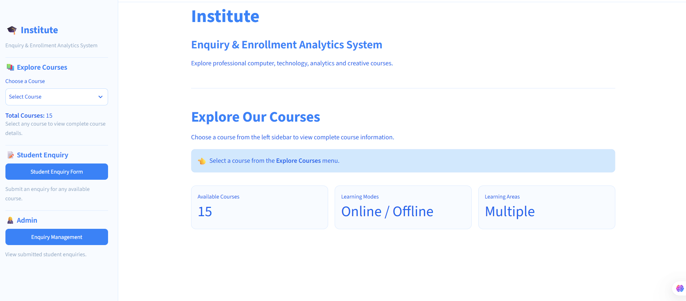

---

## Course Details

Students can explore detailed information about courses before submitting an enquiry.

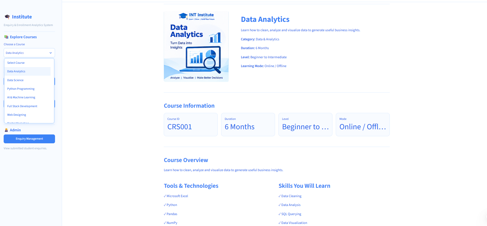

---

## Student Enquiry Form

Students can submit enquiries by providing their contact information, qualification, interested course, preferred learning mode, batch and lead source.

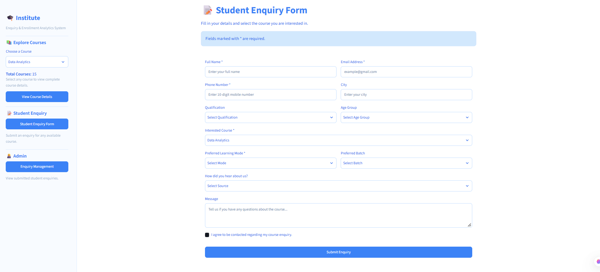

---

## Admin Enquiry Management

The admin module provides an overview of student enquiries and allows administrators to manage the enquiry lifecycle.

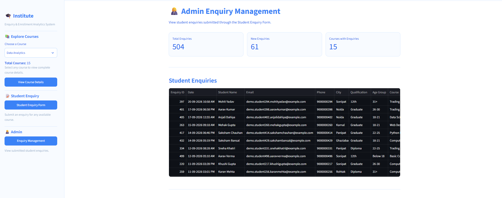

---

## Follow-up Management

Admins can update enquiry status and maintain follow-up notes for each student enquiry.

Supported statuses include:

`New → Contacted → Follow-up → Interested → Converted / Lost`

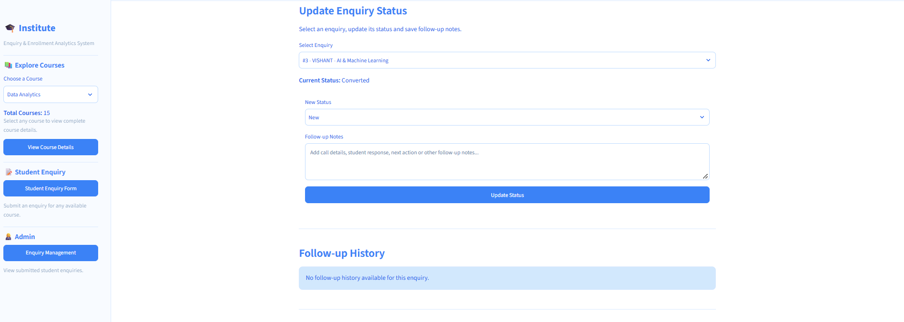

---

## Enrollment Management

Once an enquiry is converted, the student can be enrolled into the selected course.

The system records:

- Enrollment date
- Course
- Batch
- Final fee
- Enrollment status

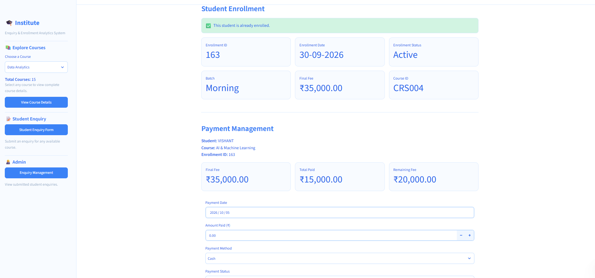

---

## Payment Management

The payment module tracks:

- Final course fee
- Total amount paid
- Remaining fee
- Payment date
- Payment method
- Payment status
- Payment history

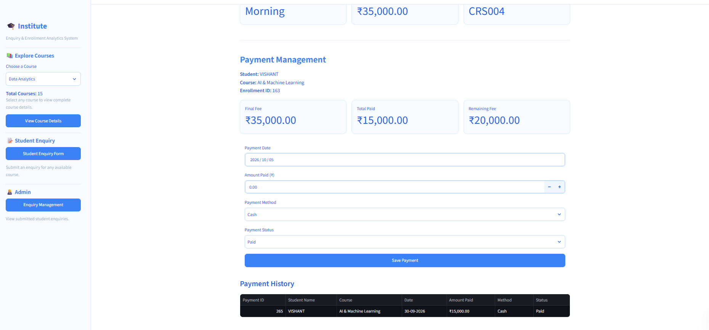

---

# Power BI Analytics

The Power BI report contains three analytical pages.

##  Executive Overview

Provides a high-level overview of enquiries, conversions, enrollments and financial performance.

Key KPIs include:

- Total Enquiries
- Converted Enquiries
- Conversion Rate
- Total Enrollments
- Total Collected
- Outstanding Amount

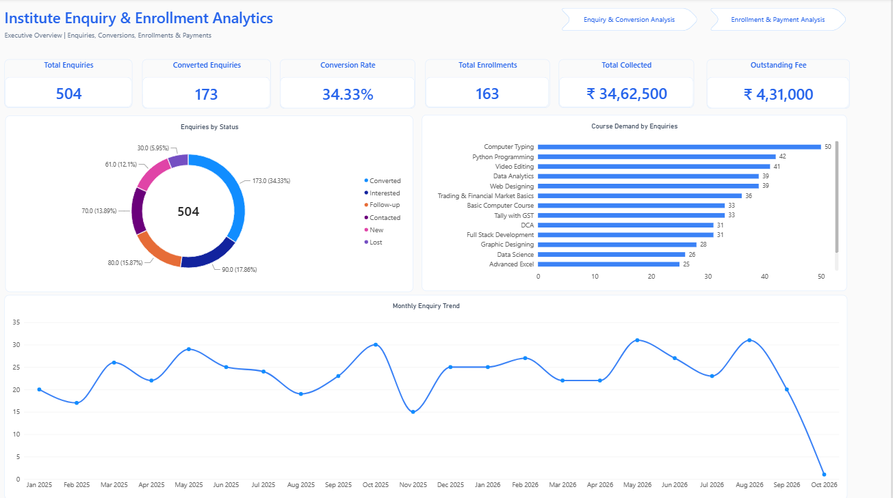

---

## Enquiry & Conversion Analysis

Analyzes student enquiry behaviour using:

- Course demand
- Enquiry status
- Lead sources
- Learning mode
- Monthly enquiry trends
- Live vs synthetic data filtering

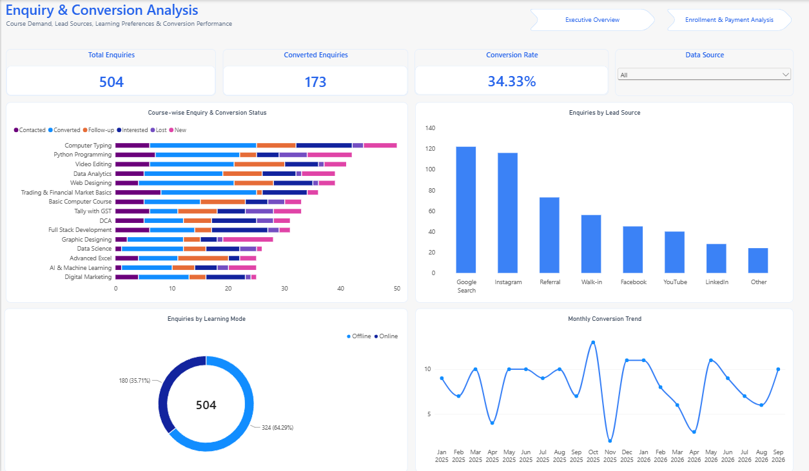

---

##  Enrollment & Payment Analysis

Provides financial and enrollment insights including:

- Enrollment count
- Total fees
- Collected amount
- Outstanding fees
- Payment methods
- Course-wise revenue
- Enrollment trends

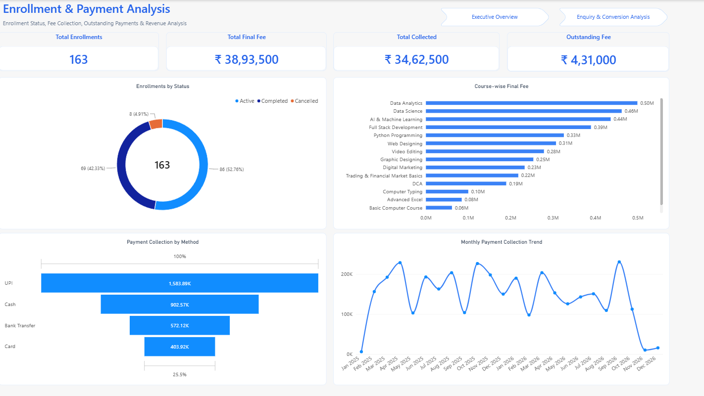

---

# Excel Analytics Dashboard

Excel was used for initial analytical exploration and dashboard development.

The workbook includes:

- PivotTables
- KPI calculations
- PivotCharts
- Slicers
- Course analysis
- Status analysis
- Lead source analysis
- Monthly trends
- Conversion analysis

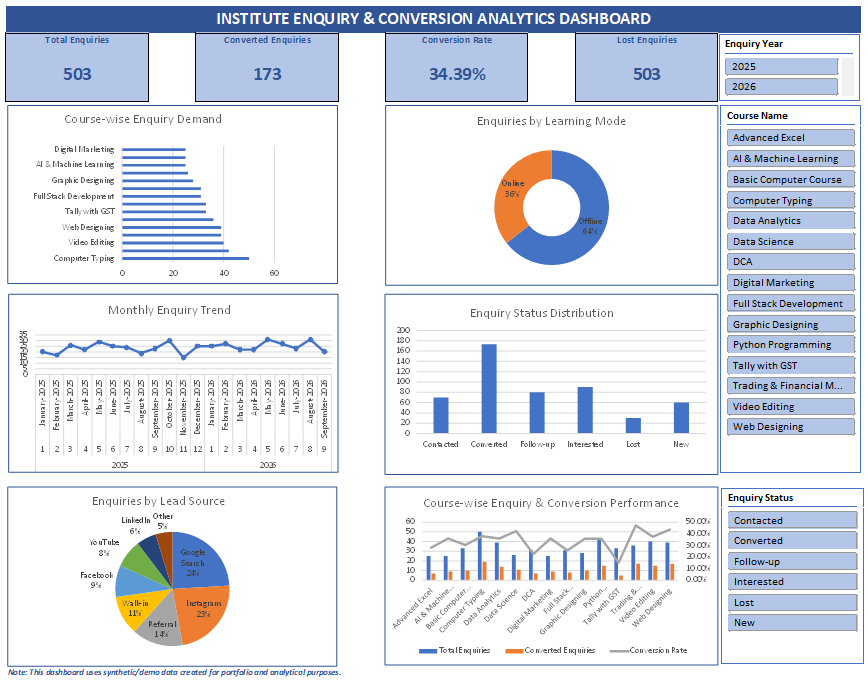

---

## 📂 Project Structure

```text
Institute-Enquiry-Enrollment-Analytics-System/
│
├── python/
│   ├── app.py
│   ├── courses.py
│   ├── database.py
│   ├── generate_synthetic_data.py
│   ├── generate_followups.py
│   ├── generate_enrollments.py
│   ├── generate_payments.py
│   └── requirements.txt
│
├── excel/
│   └── Institute_Enquiry_Enrollment_Analytics.xlsx
│
├── powerbi/
│   └── Institute_Enquiry_Enrollment_Analytics.pbix
│
├── images/
│   └── Course Images
│
├── screenshots/
│   └── Project Screenshots
│
├── database/
│   └── Database Resources
│
├── certs/
│   └── SSL Certificate
│
├── .gitignore
└── README.md
```

---

##  Security

Sensitive credentials are **not stored directly in the source code**.

The application uses Streamlit Secrets / environment configuration for:

- Database host
- Database port
- Database username
- Database password
- Database name
- Admin credentials

The local `secrets.toml` file is excluded from GitHub using `.gitignore`.

---

## Cloud Database Integration

The application uses **Aiven MySQL** as its cloud database.

This allows the application to:

1. Receive a student enquiry through Streamlit.
2. Validate the submitted information using Python.
3. Connect securely to the cloud MySQL database.
4. Insert the enquiry into the `enquiries` table.
5. Make the record available to the admin management workflow.

---

## Key Business Insights

The analytics layer helps answer questions such as:

- Which courses receive the highest number of enquiries?
- Which enquiry sources generate more leads?
- What percentage of enquiries convert into students?
- Which learning modes are preferred?
- How do enquiries change month by month?
- Which courses generate higher enrollment value?
- How much fee has been collected?
- How much payment is still outstanding?

---

## Project Objective

The objective of this project is to demonstrate an **end-to-end data analytics workflow** rather than only building a dashboard.

It combines:

**Data Collection → Database → Application → Data Management → Analysis → Visualization → Business Insights**

This demonstrates practical experience across multiple stages of a real-world analytics solution.

---

## Developed By

**Sakshi Panchal**

Aspiring Data Analyst

### Skills Demonstrated

`Python` • `SQL` • `MySQL` • `Streamlit` • `Pandas` • `Excel` • `Power BI` • `Data Analysis` • `Data Visualization` • `Cloud Database`

---

## Project Status

**Completed**

Core modules completed:

- Student Course Exploration
- Student Enquiry System
- Cloud Database Integration
- Admin Enquiry Management
- Follow-up Management
- Enrollment Management
- Payment Management
- Excel Analytics Dashboard
- Power BI Dashboard

